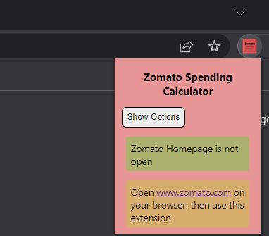
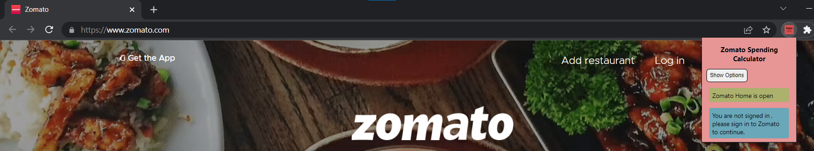
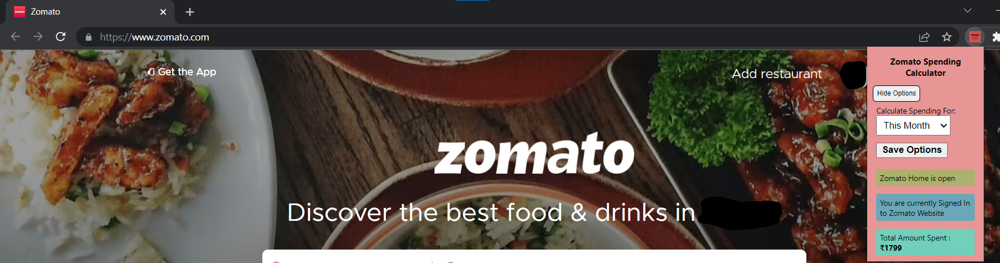

# Zomato Spending Calculator - Chrome Extension

Chrome Extension for calculating the total amount of money(in rupees) spent while ordering from Zomato App/Website. Extension has options for you to select for what time period you want to calculate the total amount of money spent. (e.g. This Month, This Year or the whole history). This extension may currently only work for Indian Zomato users.

## User Manual 

* This extension only works when the extension is being used with Zomato's Website Homepage Open and the user already should be signed in. Thus to use this extension, you have to first open Zomato's Homepage (https://www.zomato.com/) and then click on the extension icon in the top right corner of the page. You also have to sign in to your Zomato account before using this extension.
* Once you have signed in, you can use the extension to calculate the total amount of money spent in the selected time period. You change time period by selecting appropriate option.

### Screenshots

* When user is on different page than Zomato's Homepage, the extension will not work. <br />
 <br />
* When user is on Zomato's Homepage, but not signed in , the extension will not work. <br />
 <br />
* When user is on Zomato's Homepage and signed in, the extension will work. <br />
 <br />

# Development Setup

## Prerequisites

* [node + npm](https://nodejs.org/) (Current Version)

## Option

* [Visual Studio Code](https://code.visualstudio.com/)

## Includes the following

* TypeScript
* Webpack
* React
* Jest

## Setup

```
npm install
```

## Import as Visual Studio Code project

...

## Build

```
npm run build
```

## Build in watch mode

### terminal

```
npm run watch
```

### Visual Studio Code

Run watch mode.

type `Ctrl + Shift + B`

## Load extension to chrome

Load `dist` directory

## Test
`npx jest` or `npm run test`
